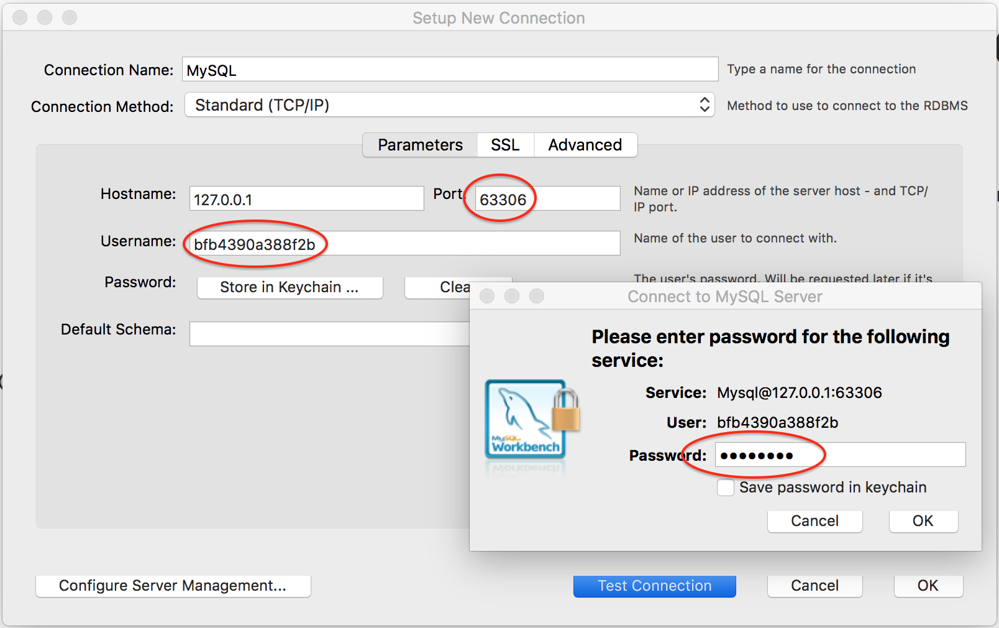

# cftunnel

## What?

It's nothing special whatsoever, just a tiny app with the sole purpose of providing a bridge for accessing back end services in Cloud Foundry just as if they were locally hosted.

For instance this allows us to connect fully featured UI tools like [MySQL Workbench](https://www.mysql.com/products/workbench/) to a MySQL database residing inside Cloud Foundry.  Without this bridging technique, we're restricted to the using the MySQL CLI tool.

## Why?

Because ...

* `cf create-service-key` is just a way of inspecting fragments of what would appear inside the `VCAP_SERVICES` environment variable should we ever happen to physically bind an app to a service.

* Our real business apps are supposed to be immutable so what business do we have hijacking a `cf ssh` call just to interfere with the port mappings inside our container?

* Basically, [these instructions](https://docs.cloudfoundry.org/devguide/deploy-apps/ssh-services.html) feel a little bit heavy-handed.

Instead, let's have a pointless, tiny NodeJS web app for arbitrary service bindings which is specifically designed for `cf ssh` port bind hijacks.

## How?

Assuming you're already logged onto PWS, you can use the following instructions:

```
git clone https://github.com/pivotal-education/public-tools.git
cd public-tools/cftunnel && cf push   # NOTE we're using a CF manifest file
cf create-service cleardb spark mysql # replace "cleardb spark" with "p-mysql 100mb" when targeting PCF
cf bind-service cftunnel mysql
cf env cftunnel                       # NOTE the VCAP_SERVICES JSON object value
```

From the `VCAP_SERVICES` environment variable you can identify `cleardb` (or `p-mysql`) values for `name`, `hostname`, `port`, `username` and `password` within the JSON object.  NOTE `name` indicates the identifier of the database Cloud Foundry generated for you.

Now we can use `cf ssh` to hijack (or leech off) the cftunnel app, thereby bridging the internal and external networks and exposing the underlying service instance on a local port.

```
# for example, if port is 3306 then localport could be a related 
# high-order port such as 63306 to avoid local port collisions
cf ssh -L [localport]:[hostname]:[port] cftunnel
```

You'll know this call worked if you get back a `vcap@xyz` command prompt.  Don't `exit` from this prompt whilst you need access to the underlying service.

Assuming you're using this for MySQL, fire up MySQL Workbench and connect to the localhost using the values you identified from the earlier call you made to `cf env cftunnel`.



### Task Complete!


